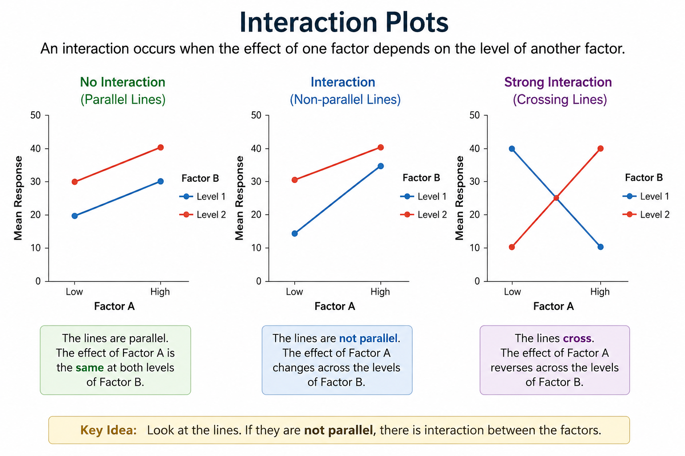

# Factorial Design

Experiments are conducted in order to invesigate the effects of one or more factors on a response variable. Factors can individually influence the response, this is called the main effects. Or some combination of factors can impact the response more than just each factor individually, this is called an interaction effect.

A completely random design is one where experimental units are assigned to treatments entirely by chance. An example of a completely random experiment would be observing 3 different fertilizers on plants. Each plant is assigned randomly to a fertilizer. 
A design is completely random if all experimental units are the same and there is no grouping or blocking taking place. 

A **Full Factorial Design** is where all possible combination of factors and levels are tested. Normal factorial designs use two levels for each factors. This gives $2^k$ possible combination for $k$ factors. 

An **interaction** exists between two or more factors if the effect of one factor depends on the levels of other factors

To observe interaction graphically, you can plot 2 lines, one for each level of the factor. On the X-axis, plot high and low levels for a second factor and on the Y-axis, plot the response variable. If the lines for your factor at 

