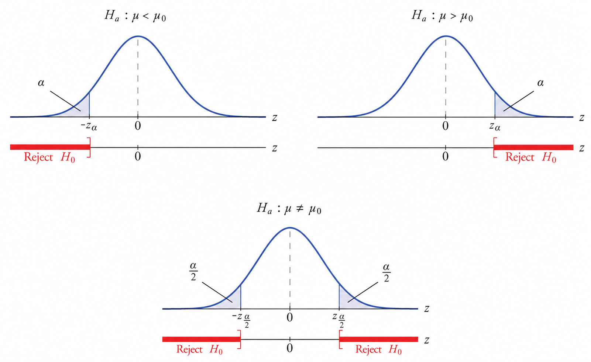

# An Introduction to Statistical Inference

If someone ever asks you, "How can you be sure?" you drop this stuff on them

Nothing is certain, but we try our best. 

An inference is just an educated guess. We gather information from a sample and use the data to make inferences (claims) on the overall population.

### Hypothesis Testing
All hypothesis tests have a similar structure. The null hypothesis, $H_0$, is a claim about a population. The alternative hypothesis, $H_a$ (sometimes $H_1$), is a claim looking to dispute $H_0$.

You can do hypothesis tests on population parameters like: $\mu,\ \sigma^2, \lambda$ and regression coefficients $\beta_i's$, along with many other things.

This is the power of statistics, we need to remember good estimators for our sample statistics, as well as what it even means to be a good estimator. 

### The Basics
The simplest type of hypothesis test out there is called a one-sample Z-test. This test is all about the population mean $\mu$.

The null hypothesis is always the same
$$
H_0:\mu = \mu_0
$$
Where $\mu_0$ is just a number, a hypothesized value for the population mean. 

The alternative hypothesis is a statement that is not true under $H_0$. The most common alternative hypothesis is
$$
H_a:\mu \neq \mu_0
$$
This is called  a two-tailed test because there are 2 **rejection regions**. If our sample statistic falls inside these rejection regions, we reject the null hypothesis $H_0$ and concluded that there is significant evidence to suggest $\mu \neq \mu_0$. We will discuss the factors that go into making this decision.

The other type of tests are similar, they are called one-tailed test.
$$
H_a:\mu < \mu_0 \newline H_a: \mu > \mu_0
$$
The first one here is called a left tail test because it is checking if the observed estimate $\mu$ is significantly less than the hypothesized value for $\mu_0$ and the second is called a right tail test because it checks if $\mu$ is significantly larger than $\mu_0$.

Almost all types of tests have these 3 alternative hypotheses. However we will see that for some tests, we only care about the right tail, $\mu > \mu_0$.

Remember, $\bar{x}=\frac{\sum_{i=1}^n x_i}{n}$ is the best estimate of the sample average. 

